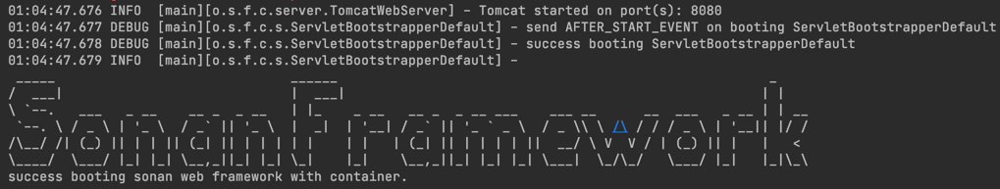
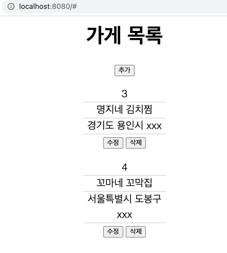

# DI Framework 구현

## 과제

1. `woowahan-di-framework`(수정: `woowahan-web-framework`으로 모듈 변경됨.) 모듈 안에 있는 요구사항을 구현해주세요.
2. `woowahan-di-framework`(수정: `woowahan-web-framework`으로 모듈 변경됨.)을 사용하여 `woowahan-app` 의 요구사항을 구현해주세요. 
3. 작업 내용을 커밋 단위으로 작성합니다.
    - `git init` 명령으로 `.git` 폴더를 생성하여 시작해주세요.

## 시연 방법 및 완료 시연 사진

###0. 시연방법 :
 * gradle을 통한 jar with dependencies 는 진행하지 못했으므로, ide를 통해 woowahan-app/src/main/java/com/mission/your/MissionApplication.java main을 Run 해준다.
 * 자세한 기능 구현 히스토리는 [TODOLIST.md](TODOLIST.md) 참고.

###1. woowahan web framework 기동 시

   
###2. woowahan app 사용 시 (framework 구현 과제이므로 제공본의 버그만 수정함.)

## 제출 방법

- 불필요한 파일 제외하여 압축하여 제출합니다. `.git` 폴더는 포함되어야 합니다.
- 압축이 풀린 소스에서 `./gradlew test` 가 성공하여야 합니다.

## 주의사항

- 요구사항의 전체 구현 여부가 합격, 불합격의 필수 기준은 아닙니다.
- 본 문제는 우아한형제들의 지적 재산으로 유출을 엄격히 금지합니다.