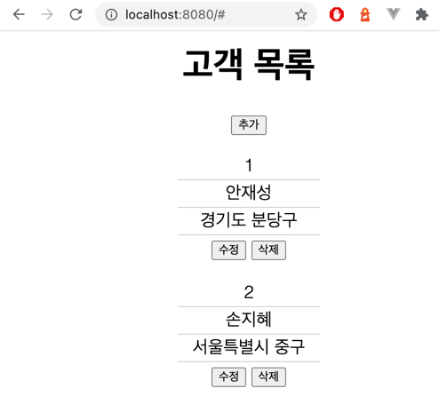

# Sonan Framework 구현

## 토이프로젝트 진행 설명
1. `sonan-framework`는 멀티 모듈 프로젝트로 진행하며, 기능으로 IoC Container, MVC, RestAPI, Static Resource 제공만 지원한다.
2. `sonan-framework`을 사용해 `sonan-user-manager-app`시연용 을 만든다.

## 시연 방법 및 완료 시연 사진

### 0. 시연방법 :
 * gradle을 통한 jar with dependencies 는 진행하지 못했으므로, ide를 통해 sonan-user-manager-app/src/main/java/org/sonan/user/manager/UserManagerApplication.java main을 Run 해준다.
 * 자세한 기능 구현 히스토리는 [TODOLIST.md](TODOLIST.md) 참고.

### 1. machine별 동일한 전체 테스트 방법
- 압축이 풀린 소스에서 `./gradlew test` 진행.

### 2. Sonan Framework 기동 시

   
### 3. Sonan User Manager App 예제 사용자 앱 기동 시

